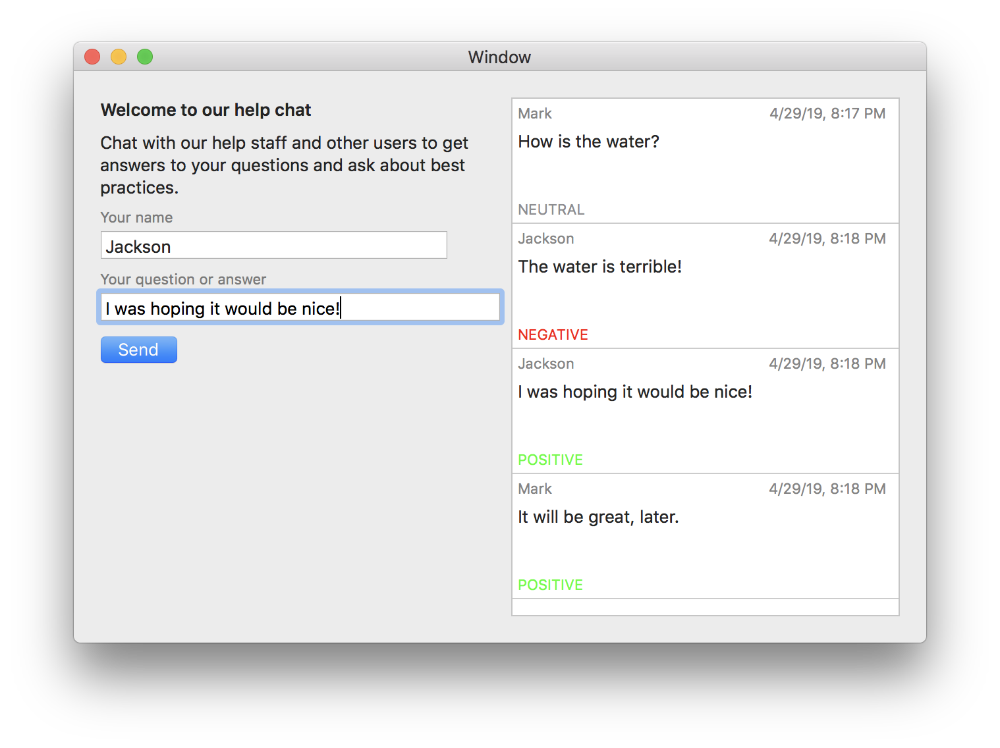
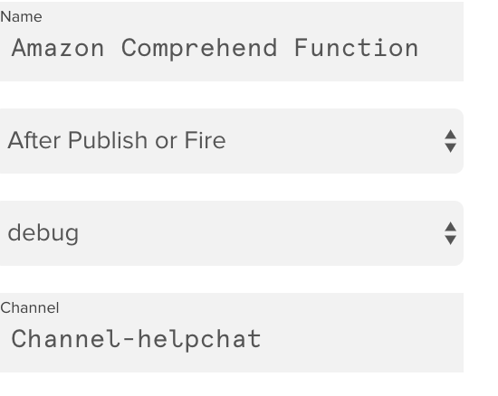
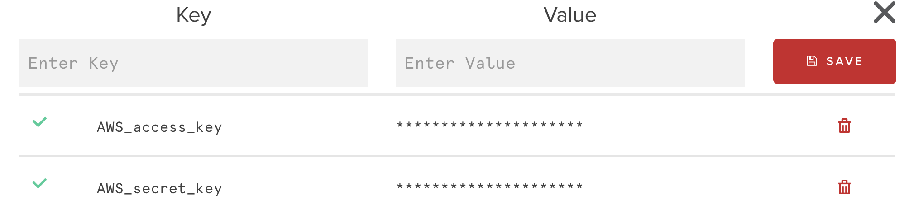

SentimentChat - PubNub and AWS Comprehend
=====================================

A MacOS (Objective-C) in-app chat demonstration project using @pubnub for real-time publish/subscribe and @aws comprehend for sentiment analysis.

## The scenario, or, why is the Xcode project called "The Help Center"
Imagine your boss told you the new app your company is about to release needed a help channel in-app with a real time chat feature. They very specifically want all users to be able to chat with other users. However, they are concerned about the conversation 'going negative,' so one of the requirements is checking the sentiment of the chat and filtering or otherwise intercepting negative speech in an automated way.

## Downloadable demo
You can download the [demo app](readme_assets/the_help_center.zip). You will need your own PubNub keys to run it (it asks on the first screen).

## The main chat interface



## Technologies chosen
* PubNub: "Build powerful and feature-rich realtime chat apps, powered by flexible APIs and a global messaging infrastructure." - I'm just using thier pub/sub and app integration points here. There's also user presence, deeper security and many other things you can do with their core engine. On top of that, they have SDKs for most any language you can think of.
* AWS Comprehend: "Amazon Comprehend is a natural language processing (NLP) service that uses machine learning to find insights and relationships in text." Comprehend can do entity analysis and many other things with unstructured text, in this we just use the sentiment analysis.

## How it works
The bulk of the work is done in THCHelpChat.m. After loading up your config and starting up the PubNub client, we listen `[self.pubNubClient subscribeToChannels: @[self.mainChannel, self.sentimentChannel] withPresence:NO];` on two channels (as far as I can tell, you can name the channels to your liking):

* `Channel-helpchat` - this is where all the chats are sent and received. The main room.
* `Channel-sentiment` - this is where the sentiment information (positive, negative, neutral) is sent back by AWS.

Each chat is sent on `Channel-helpchat` which is routed back to all subscribers. In addition, there's a function set in the PubNub system that listens to `Channel-helpchat` and sends the incoming message to the AWS Comprehend system to parse. Comprehend returns that sentiment information back on the separate sentiment channel (`Channel-sentiment`). In this demo, everyone sees each message's sentiment but since the design is envisioned to allow only subscription by admins to monitor the health of the chat.

`cleint:didReceiveMessage:` is the workhorse of the `PNObjectEventListener` protocol. It recieves the message data as an `NSDictionary`. 

Speaking of the `message`, the message is any JSON. It took me a while to realize that there's no structure imposed by PubNub in what you send. When receiving, the message received will have some other meta-data with it to assist in understanding the channel and other related information this message is wrapped in.

There's much more to be done with PubNub, go read the [docs](https://www.pubnub.com/docs/ios-objective-c/pubnub-objective-c-sdk)


## To build something similar

Note: Both services have free tiers for testing/dev.

You will need to install the PubNub SDK for Cocoa (I used Carthage) from [https://www.pubnub.com/docs/ios-objective-c/pubnub-objective-c-sdk](https://www.pubnub.com/docs/ios-objective-c/pubnub-objective-c-sdk)

You'll need an AWS account. Then install the AWS Comprehend block into your [PubNub environment]( https://www.pubnub.com/docs/blocks-catalog/amazon-comprehend) (Click "Try it Now"). Note: you cannot install the block/function from your PubNub console but it does appear in "Functions (aka Modules)" after it is installed.

After installing, I set up the PubNubb <-> Comprehend adaptor with the following settings:



"Channel-helpchat" is the channel I want the AWS function to listen to for chats to analyze. 

Add your AWS secrets to the secrets vault:



The keys to have are `AWS_access_key` and `AWS_secret_key`. You can get them from the AWS AMI panel.

I modified the javascript for the provided AWS Comprehend function:
```
                    return xhr.fetch('https://' + sentimentOpts.host, sentimentHttp_options)
                        .then(function (response) {
                            console.log(payload.text);
                            var sentiment = JSON.parse(response.body)
                                var sentimentMessage = {
                                    "sentiment": sentiment,
                                    "sender":"1510099933557",
                                    "event":"sentimentAnalysis", 
                                    "originalUUID": payload.uuid
                                }
                                pubnub.publish({ message: sentimentMessage, channel: "Channel-sentiment" });
                            console.log(sentiment);
                            return request.ok();
                        }).catch(function (error) {
                            console.log(error);
                            return request.ok();
                        });
```

The main change was to send back sentiment on every parse instead of just on negative sentiment (as is the default). Also, sending back the UUID from the original message payload allows us to connect the message to the sentiment when the sentiment is sent back on the `Channel-sentiment` channel.

Fire it up and start chatting.

## Notes
### Future directions
* Do not show negative sentiment chats without some form of human gating (moderation).
* Allow users to directly 1-1 chat with a support agent outside of the main chat. Would require a separate channel and some access work. Doable with PubNub from reading the docs, but I did not work on this.
* Add presence for online/offline.
* Calculate sentiment for the last hour/day similar to show to 'admins'.
    * Add roles such as admins
* Push web pages or other content as optional parts of chat payload. When received, offer to open for user, possibly in an expanded part of help center.
    * Filter by user to avoid abuse.
* Allow rollback of recent history when users join the chat.

### Notes on code
* Do not look at this as 'best practice' cocoa development. I took some shortcuts:
    * Most of the logic should be in a separate NSView controller, not in the NSWindowController
    * The NSTableDelegate and DataSource methods should be off in their own class, not part of the window or view controller. 
* Normally the publish and subscribe keys are in the code itself. This requires doing some work to hide the keys. Knowing that nothing truly prevents a dedicated person from getting them, [CocoaPods-keys](https://github.com/orta/cocoapods-keys) or [Obfuscator-iOS](https://github.com/pjebs/Obfuscator-iOS) can help.

### Notes on the Community aspects of this solution
* Having an unregulated and unmonitored real-time chat in your app is probably a bad idea. If it can be monitored, it's probably a really good addition especially when paired with pushable help pages.
* Consider what kinds of real-time usage information you could gather using PubNub. Or, add gamification to your app with real-time updates. Each of these has potential privacy implications so consider with care.
